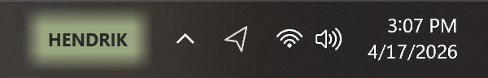

# WhichBox

A small Windows taskbar indicator that displays the current machine name. Helpful when you frequently switch between VMs or remote desktops and need a quick visual cue for which machine you're on.



## Features

- Sits directly in the taskbar, just left of the system tray
- Color-coded background with 12 muted pastel colors -- each machine gets a deterministic default based on its name
- Right-click to pick a different color or exit
- Remembers your color choice across restarts
- Starts automatically on login
- Single native executable with fast startup (NativeAOT)

## Requirements

- Windows 10 19041+ or Windows 11
- [.NET 10 SDK](https://dotnet.microsoft.com/download/dotnet/10.0) (for building)

## Install

```powershell
git clone https://github.com/chsienki/WhichBox.git
cd WhichBox
dotnet run install.cs
```

This builds, installs to `%LOCALAPPDATA%\WhichBox\`, registers for auto-start on login, and launches the app.

## Usage

- The indicator appears in the taskbar to the left of the system tray
- **Right-click** to open the context menu:
  - Pick a color from the palette
  - Reset to the default color
  - Exit

## Uninstall

Run the uninstall script, or remove manually:

```powershell
# Script (kills process, removes registry entry and files)
dotnet run uninstall.cs

# Or manually:
# 1. Right-click the indicator and choose Exit
# 2. Remove the startup entry and install directory:
Remove-ItemProperty -Path "HKCU:\SOFTWARE\Microsoft\Windows\CurrentVersion\Run" -Name "WhichBox"
Remove-Item -Recurse "$env:LOCALAPPDATA\WhichBox"
```

## Development

```powershell
# Debug build
dotnet build src\WhichBox\WhichBox.csproj -c Debug
src\WhichBox\bin\Debug\net10.0-windows10.0.26100.0\WhichBox.exe
```

## License

MIT
